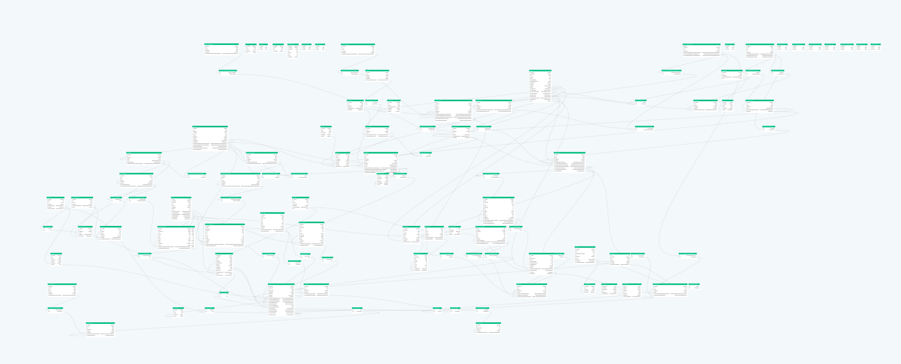

<p align="center">
  
</p>

<h1 align="center">Prisma Viewer</h1>
<p align="center">
 <a href="https://www.npmjs.com/package/prisma-viewer">
  
  </a>
    <a href="https://www.npmjs.com/package/prisma-viewer">
    
    </a>
</p>

**🐉 Here be dragons!!**

For use with [Prisma](https://www.prisma.io/) Datamodels

## Installation

```
  npm i -g prisma-viewer
```

canary

## Usage

```
    Prisma Viewer   ಠ_ಠ

    Usage
      $ pv [path]

    Options
      -h, --help       Displays this help message
    Examples
      $ pv
      $ pv ./schema.prisma
```

When viewing the schema/datamodel:
- Press the `a` key to change the layout
- Use a `scroll wheel` to `zoom in/out`
- `Click and drag` to `pan`

## Development

`npm run dev [path/to/datamodel]`
